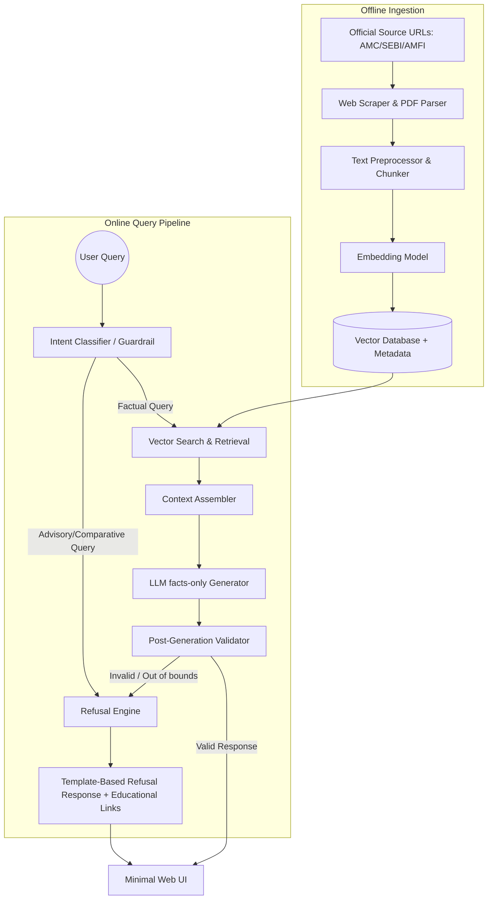

# System Architecture: Mutual Fund FAQ Assistant (Facts-Only RAG)

This document outlines the technical architecture for the **Mutual Fund FAQ Assistant**, a facts-only, Retrieval-Augmented Generation (RAG) system built with strict compliance and factual accuracy guardrails.

---

## 1. System Overview

The system is split into two primary pipelines:
1. **Offline Ingestion Pipeline**: Scrapes, chunks, embeds, and indexes official Mutual Fund documents (Factsheets, SIDs, KIMs, FAQs) into a Vector Database.
2. **Online Query & Inference Pipeline**: Classifies user intent (fact vs. advice), retrieves relevant chunks, generates a facts-only response constrained by safety rules, and serves it via a minimal UI.



## Phase 0: Curated Source URLs (Target Corpus)

For this project, the ingestion corpus will consist of the following target HDFC Mutual Fund pages on Groww:
1. HDFC Mid-Cap Opportunities Fund: https://groww.in/mutual-funds/hdfc-mid-cap-fund-direct-growth
2. HDFC Top 100 Fund (Large Cap): https://groww.in/mutual-funds/hdfc-large-cap-fund-direct-growth
3. HDFC Small Cap Fund: https://groww.in/mutual-funds/hdfc-small-cap-fund-direct-growth
4. HDFC Gold ETF Fund of Fund: https://groww.in/mutual-funds/hdfc-gold-etf-fund-of-fund-direct-plan-growth
5. HDFC Defence Fund: https://groww.in/mutual-funds/hdfc-defence-fund-direct-growth

---

## 2. Component Breakdown

### A. Offline Ingestion Pipeline (Phase 1 Subphases)

*   **Subphase 1.1: Web Scraper (HTML Downloader)**
    - Implement the logic to query the HDFC Mutual Fund pages on Groww.
    - Save the raw HTML files locally for validation and debugging, with retry mechanisms and User-Agent headers.

*   **Subphase 1.2: DOM Parser & Content Extraper**
    - Clean and parse target HTML using `beautifulsoup4`.
    - Extract text, tabular financial values (such as expense ratios, exit loads), and headings.

*   **Subphase 1.3: Document Parser & Metadata Handler**
    - Package the parsed data into JSON format.
    - Attach document metadata: `source_url`, `last_updated`, `scheme_name`, and `amc_name`.

*   **Subphase 1.4: Chunking Evaluator (Single-Scheme Profile Chunking)**
    - Instead of chunking raw, noisy HTML blocks, the ingestion pipeline will store each fund's complete parsed `summary_text` as a single, atomic chunk.
    - This "Document-as-a-Chunk" approach ensures that critical numeric variables (NAV, minimum SIP, expense ratio, exit loads, and tax implication details) are never decoupled, preventing cross-fund parameter hallucination during context generation.

*   **Subphase 1.5: Embeddings & Local Vector Index Ingestion**
    - Load chunks into `chromadb`.
    - Generate vector embeddings using a local HuggingFace/SentenceTransformers model (e.g., `all-MiniLM-L6-v2`).
    - Test similarity search queries to verify indexing accuracy.

---

### B. Online Query Pipeline & Guardrails

1. **Intent Classifier (The Guardrail)**:
   - Evaluates incoming queries using zero-shot classification or a lightweight model/prompt to detect advisory or speculative keywords (e.g., "should I buy", "which is better", "future returns").
   - If the query is flagged as **Advisory**, it bypasses the LLM facts-only pipeline and immediately triggers the **Refusal Engine**.

2. **Retrieval**:
   - If the query is **Factual**, it queries the Vector DB to retrieve the top-K (typically 3–5) most relevant context chunks matching the query embeddings.

3. **LLM Generator**:
   - Employs a generation model via Groq API (e.g., `llama-3.1-70b-versatile`, `llama-3.1-8b-instant`) set to **temperature = 0** to strictly minimize hallucinations.
   - Uses system prompting instructions to enforce strict boundaries.

---

## 3. Strict Compliance & Formatting Guardrails

### System Prompt Design
The LLM generator is constrained using a highly structured system prompt:

```text
Role: You are a facts-only Mutual Fund FAQ Assistant.
Task: Answer the user's query using ONLY the provided contexts. Do not assume, extrapolate, or recommend.

Constraints:
1. Limit your answer to a maximum of 3 sentences.
2. Under no circumstances provide investment advice, comparison advice, or subjective suggestions.
3. If the context does not contain the answer, state that you do not have that information and redirect to the source link for details.
4. Include exactly one citation link at the end of the answer using the exact source URL provided in the matching context.
5. Append a footer exactly matching this format: "Last updated from sources: <date>"
```

### Refusal Engine Templates
When advisory queries are detected, the Refusal Engine serves a pre-configured template response:
*   *Template*: "I can only assist with objective, factual information about mutual fund schemes. I cannot provide investment advice, recommendations, or comparisons. For investment guidance, please consult a registered financial advisor or refer to the official resources: [AMFI India](https://www.amfiindia.com) or [SEBI Investor](https://investor.sebi.gov.in)."

### Post-Generation Validator
A final software validation check runs before presenting the output to the user:
- **Length Check**: Asserts the sentence count of the LLM output is $\le 3$.
- **Citation Check**: Verifies exactly one valid HTTP/HTTPS URL exists in the response.
- **Footer Check**: Confirms the presence of the last-updated date footer.
- **Privacy Scan**: Checks for PII (PAN, OTPs, Aadhaar, account numbers) and strips/redacts if found.

---

## 4. Proposed Technology Stack

- **Frontend**: Streamlit or simple HTML/CSS/JS frontend (providing a clean, minimal UI with a visible disclaimer, welcome message, and 3 sample questions).
- **Backend Framework**: FastAPI (Python) or Express.js.
- **RAG Orchestrator**: LangChain or LlamaIndex (or direct API integration for minimal overhead).
- **Vector Database**: Chroma DB (lightweight, runs locally) or FAISS.
- **LLM/Embeddings**: Groq API (for high-speed model inference, e.g., Llama-3.1 models) and local HuggingFace/SentenceTransformers embeddings.
- **PDF Extraction**: PyPDF or pdfplumber.
